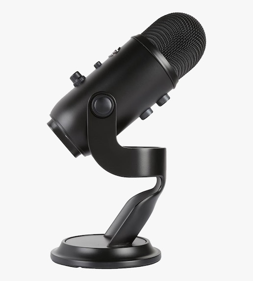

+++
author = "Shiraz"
date = 2020-11-25T17:53:00Z
description = "These days, your shoes don't matter"
image = "ameer-basheer-T29AcrDfWsY-unsplash.jpg"
tags = ["teleworking"]
title = "In 2020, you are what you Sound Like"

+++
Working in big Tech for the last 10+ years means I’m no stranger to remote working, working with global clients over the last 3-5 years means I’ve participated and hosted my fair of remote Zoom-style calls before C-19 kicked us all in the nads, although, full disclosure, for important first time meetings we jumped on planes, even for transatlantic business. As glamorous as that sounds, it’s really not - a topic for another day!

It’s very difficult to replicate and to capture all the nuances and unspoken details that occur in a face-to-face meeting - I think most reading will know this already, after all it’s Nov-2020. And, I guess this is exactly what ‘rubs-me-the-wrong-way’, enough to make me want to write about it!

Tech speakers, who should be veterans at this presenting game are doing remote presentations horribly! What makes this even worse is how easily 90% of the ills could be addressed with little effort. Imagine taking out time as a participant to hear a presenter ‘um’ and ‘err’ for 45 minutes from what sounds like potato?

## Below is the piece I posted on LinkedIn - simple, yet very effective ways to improve you’re next conf. call!

## How to Make Your Work-from-Home Calls 97% Better

It’s unfair, but universally recognised that our subconscious cognition runs at neck-break speeds to aid our everyday decision-making, most of which is on auto-pilot. Essentially, we're all experts at judging on first impressions.

One of my favourite authors, Malcolm Gladwell writes amazing insights on the unconscious bias in a book called [BLINK](https://geni.us/eDaB5), if you’re remotely interested in this area of psychology, how we can understand bias and even influence it, this book is worth a read (or two).

SO, how can we put our best, virtual foot forward when using Zoom, Teams, GoToMeeting and the rest? Here’s how you can sound amazing without spending too much!

In order of costs (most cost-effective options first).

## 1. Use that wired-headset

Using the old wired headset in your draw is a great option. If you’ve watched a live TV interview recently, where the guest speaker is at home, you’ll notice most are now wearing the good old-fashioned wired-headset.

Having a single wire with individual hardware sources for both Microphone and in-ear speakers make for an elegant yet very effective solution.

I know a guy, who knows a girl, who's a sound check engineer for a TV broadcaster, they now almost exclusively request guest speakers use wired headsets, notice how the mic is perfectly positioned close to your mouth?

## 2. Use a Bluetooth headset

There are too many recommendations here, for me, the Apple AirPods integrates well with my phone and laptop. Whilst it visually looks better not to have a running wire (and you can do cartwheels whilst wearing them). The sound quality just isn’t as good as a wired headset. Don’t believe me? test it! use your phone's voice recorder app and compare the wired headset voice recording vs a Bluetooth option - I was surprised too. Bluetooth headsets are great, I've been a user for years - for calls where I'm required to do some speaking however, I'm leaning towards the wire.

## 3. Use a dedicated USB Microphone:

This will make the audiophiles cringe, I know XLR solutions are the far superior option! but for us, work-from-homers, who just need something simple and plug n' play, USB is the simplest option. So if you want to take your sound game up a level, without investing in audio interfaces, preamps, cables and sound cards, [get yourself one of these](https://geni.us/ABKH803). Yep it’s pricey, but it’s still cheaper than parking your car at Heathrow for a two-day business trip you could have had over Zoom? (maybe)

Personally, I use the Blue Snowball (the younger brother to the one I’ve linked), it costs around £50, only, it’s eight years old and is always out of stock. I’ve used the Blue Yeti (pictured above), it’s very slick, looks great on the desk and produces higher quality sound compared to my Snowball. If the price of the Yeti is an issue, look for the Blue Snowball on eBay, don't pay more than £50 though.

## Avoid...

Whatever you choose, avoid using an in-built laptop mic and loudspeaker, because;

## you’ll likely be too far away from the mic
## the choice of microphone component in your laptop was made in a pre-COVID era
## lastly, your mic is likely to be caked in irremovable dust.
Also, when you use your laptop speaker for sound and your laptop mic as input, your machine (or some software) has to work hard to prevent the sounds from your speakers going back into the call. This solution just isn’t elegant - especially when so many cost-effective solutions exist.

## Bonus Tip: Your Webcam

It’s been long said the Logitech line-up of webcams are the best choice out there, they were completely unavailable during March/ April 2020. [The C920 for the tech-savvy](https://geni.us/rH2isKD) and the [Brio Stream for](https://amzn.to/3iXrpzU) those with a flash view (and amazing broadband). These two are (according to PCMag) the top choices, I have another option, it’s Free…

## Your Phone!

Your phone (if not ancient) has an amazing front-facing camera. I’m talking colour and light correction, saturation, exposure and more. Zoom, Teams, and GoToMeeting native apps all support phone cameras, just be sure to put your phone on silent and use a [phone desk clamp like this](https://geni.us/2cjxa), yes the clamp is hideous, but you can fold it away and hide it when not in use.

# That’s it - may your next call be better than the last.

The small print(s) I know there are differences in Bluetooth h/w, the pros and cons of v3 vs v4, the frequencies, bandwidth and energy consumption variants etc. The point is, most people outside of the audio business don’t care for these details. When I was commuting I’d only listen to stuff using my Bluetooth headphones - which worked great and I’ve never dropped my phone because of a stray cord since. Sat at home, in a fairly static position however, I find a wired headset can work amazingly well.
Affiliate links, I’ve used affiliate links in this post which means if you click&buy using a link, and if the stars align, and if the wind is blowing in the right direction, I may get thrown some pocket change in return.